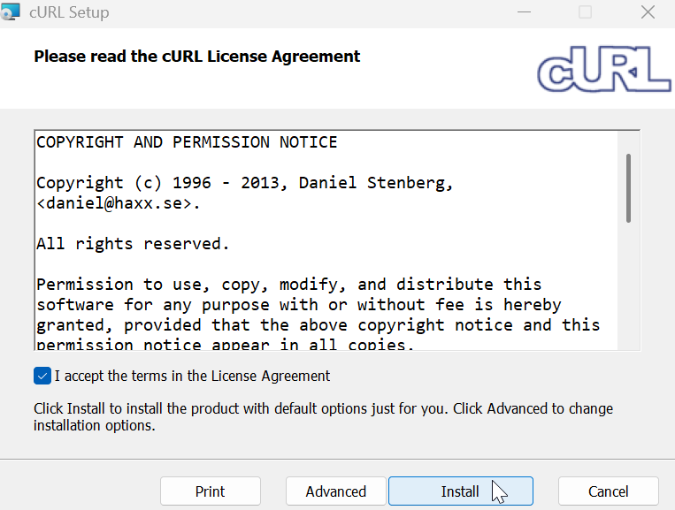

# Install curl on Windows

curl is a command-line tool and library used for transferring data with URLs. It is popular for:

- **API testing**: You can check if an API is working correctly by sending requests and seeing the raw response.

- **automation**: Since it’s a command-line tool, it can be put into scripts to automate tasks like downloading files or checking website uptime.

- **debugging**: curl provides detailed information about the connection, including headers and handshakes, which helps find where a connection is failing.

To install curl on Windows:

1. Download curl on the [official website](http://www.confusedbycode.com/curl/#downloads).

    :::tip
    The installation method for curl depends on whether you have administrator access on your computer.
    :::

2. Check the box to accept the terms and conditions in the License Agreement. Click **Print** to print the agreement or download it as a PDF.

    

3. Click **Install**. The installation begins. To configure the installation, click **Advanced**.

4. Click **Finish** after the installation is complete.

As a result, curl is installed. To check the curl version, open and command-line tool and run:

```
curl -v
```
