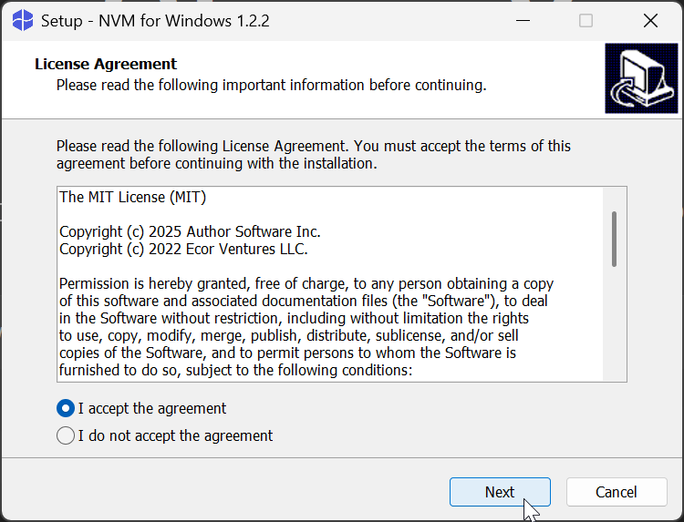
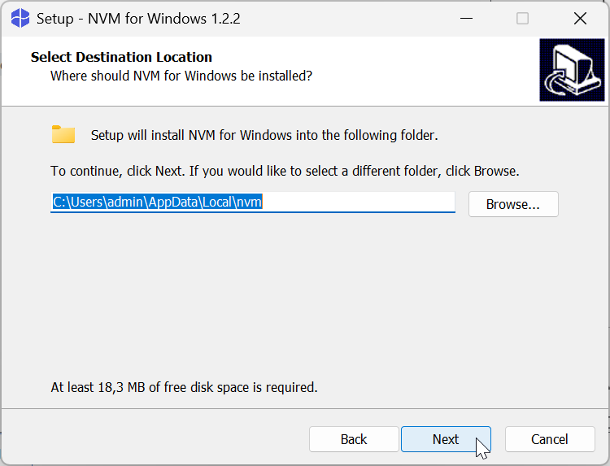
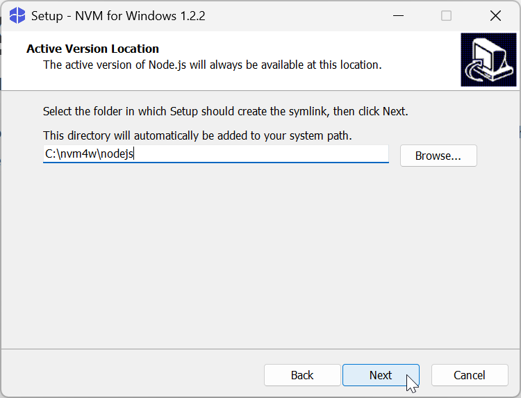

# How to install NVM on Windows

To install NVM on Windows:

1. Download the NVM installer from the [official site](https://www.nvmnode.com/guide/download.html).

    :::info
    Use the [latest stable nvm release](https://www.nvmnode.com/guide/download.html#latest-release) for maximum security and efficiency.
    :::

2. Unzip the `nvm-setup.zip` archive with Winrar, 7-zip, or other file archiver.

3. Launch the `nvm-setup.exe` file.

4. Read and accept the license agreement.

    

5. Click **Next**.

6. Select the destination folder for the installation. The default destination folder is `C:\Users\admin\AppData\Local\nvm`. Click **Browse** to select a different destination.

        

7. Click **Next**.

8. Select the [symlink](https://dev.to/unorthodev/utilizing-symbolic-links-in-your-node-js-projects-17bo) destination for Node.js.

    

9. Click **Next**.

10. Click **Install**.

    

As a result, nvm is installed to your computer.

To check the nvm version, open CMD, Powershell, or other command line operator and run:

```
nvm --version
```

If the installation is successful, the nvm version is displayed in the terminal. For example, `1.2.2`
